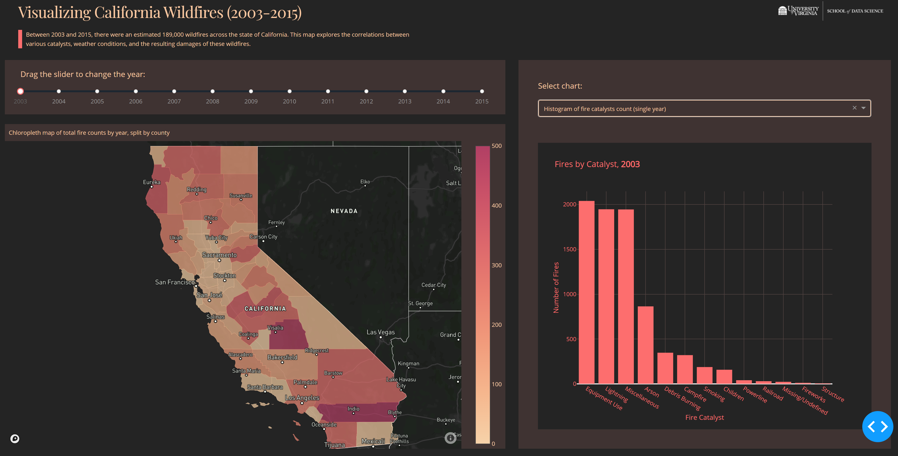

# Visualizing California Wildfires (1992-2015)
by Timothy Tyree, Christian Schroeder, Alexander DeLuca, and Antoine Edelman

UVA School of Data Science, CS 5010

Between 1992 and 2015, there were an estimated 189,000 wildfires across the state of California. Wildfires can be a devastating natural disaster if not properly monitored, researched, and mitigated. For this project we created a web map that allows easier visualization and analysis of wildfires, their catalysts, and their destruction with the goal that it could be used by state and local governments in key policy making decisions involving wildfire reaction procedures. Our web map explores the correlations between various catalysts, weather conditions, and the resulting damages of these wildfires. A more in-depth explanation of our process can be found in our [Final Report](Report/Final-Report.md).

Dashboard: [Visualizing California Wildfires (1992-2015)](https://california-wildfire-analysis.herokuapp.com/)

