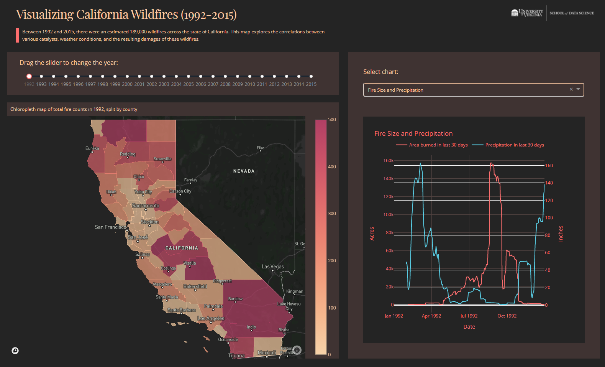

# Visualizing California Wildfires (2003-2015)
by Timothy Tyree, Christian Schroeder, Alexander DeLuca, and Antoine Edelman

UVA School of Data Science, CS 5010

Between 2003 and 2015, there were an estimated 189,000 wildfires across the state of California. This web app explores the correlations between various catalysts, weather conditions, and the resulting damages of these wildfires.

Dashboard: [Visualizing California Wildfires (2003-2015)](https://california-wildfire-analysis.herokuapp.com/)

