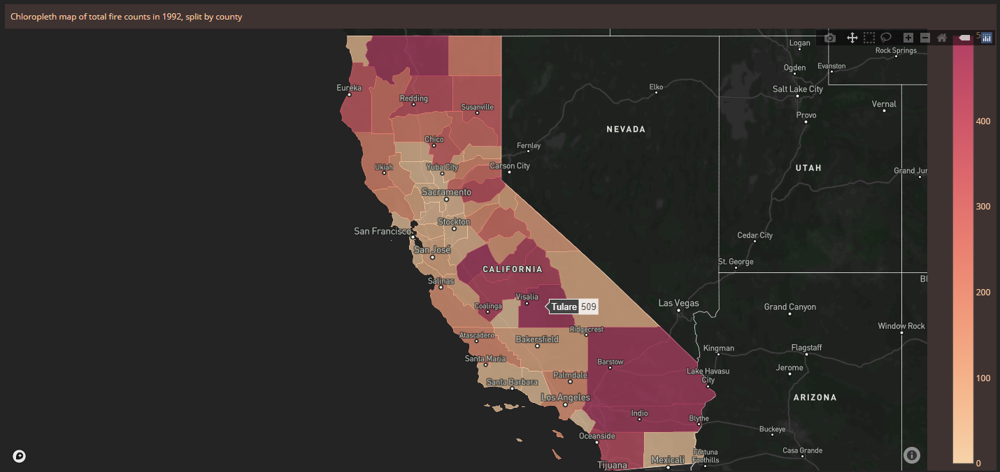
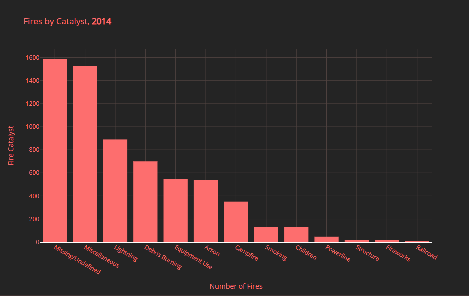
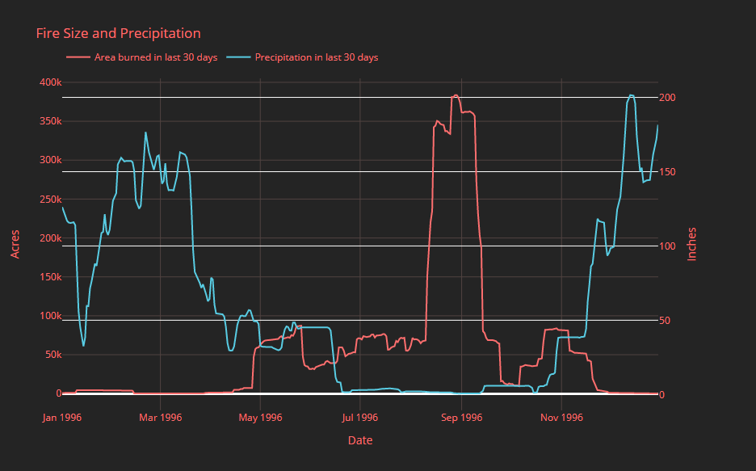
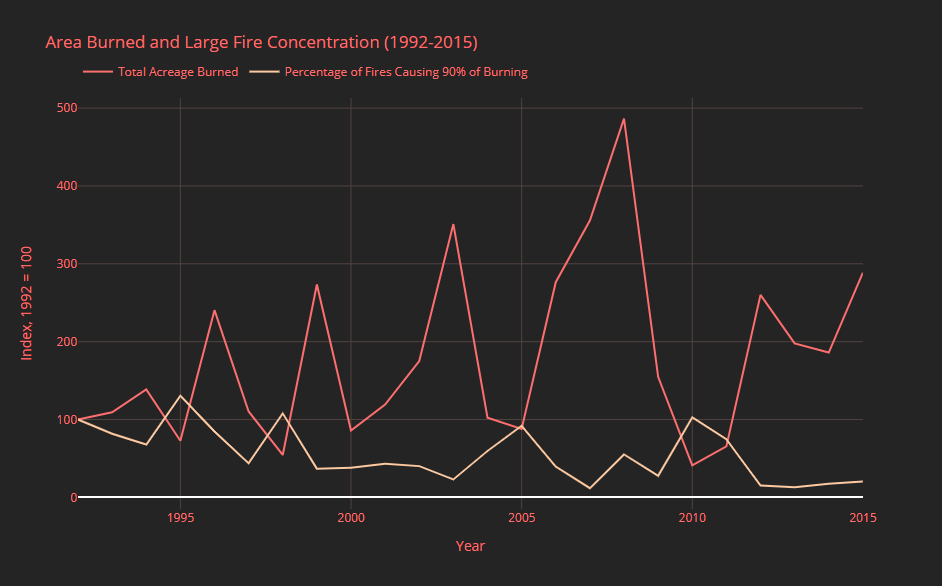

# Visualizing California Wildfires (1992-2015)
by Timothy Tyree, Christian Schroeder, Alexander DeLuca, and Antoine Edelman

UVA School of Data Science, CS 5010

## Introduction
Between 1992 and 2015, there were an estimated 189,000 wildfires across the state of California. Wildfires can be a devastating natural disaster if not properly monitored, researched, and mitigated. These fires have recently caused frequent news coverage and even migration. For this project we created a web map that allows easier visualization and analysis of wildfires, their catalysts, and their destruction with the goal that it could be used by state and local governments in key policy making decisions involving wildfire reaction procedures. Our web map explores the correlations between various catalysts, weather conditions, and the resulting damages of these wildfires.

Dashboard: [Visualizing California Wildfires (1992-2015)](https://california-wildfire-analysis.herokuapp.com/)


## The Data
We utilized several sources to develop our final dataset of wildfires in California. The primary dataset we used was 1.88 Million US Wildfires from [Kaggle](https://www.kaggle.com/rtatman/188-million-us-wildfires), a spatial database of wildfires that occurred between 1992 and 2015 across the United States. The records were acquired from the federal, state, and local fire organization reporting systems. The data was downloaded locally as a SQLite database.

The original fires dataset contained 50 columns, 41 of which we did not find necessary for our visualization and analysis. Taking into account the granularity of the data, with points accurate to 1-square mile grids, we determined the optimal geography for this data would be at the county level. To add county information to each fire, we used county shapefiles provided by the United States Census' [TIGER/Line database](http://www2.census.gov/geo/tiger/TIGER2020/BG/tl_2020_06_bg.zip). The final fire dataset is comprised of the following columns:

- OBJECTID: Unique record identifier
- FIRE_YEAR: Year the wildfire occured
- STAT_CAUSE_DESCR: Catalyst of the wildfire
- FIRE_SIZE: Area burned by the wildfire (Acres)
- FIRE_SIZE_CLASS: Classification of the fire size
- LATITUDE: Latitude coordinate of the wildfire's origin (decimal degrees)
- LONGITUDE: Longitude coordinate of the wildfire's origin (decimal degrees)
- GEOID: US Census Geographic Identifier
- STCT_FIPS: County FIPS code
- DATETIME: Date the wildfire started (YYYY-MM-DD)
- MONTH: Month the wildfire occurred

Some steps we took additionally to have a clean dataset were to format the date, remove duplicates, and correct any formatting. When we first imported the date and converted it to datetime, we found that the years were not realistic and had to be converted differently. Also, there were some duplicate fire unique identifiers since that set combined multiple sources. Lastly, we changed some of the column formats to allow the aggregation to be consistent across sources.

To supplement our fire data with additional environmental conditions, we pulled [hourly rainfall measurement data](https://www.ncdc.noaa.gov/cdo-web/search) from 2003-2015 from all NOAA Weather Stations throughout California. The RAW precipitation data consisted of measurements by the hour for each station. We had to strip out missing values and observations with low data quality flags. It also included lat/lon coordinates of the station and elevation data. Using those station coordinates we aggregated the precipitation measurements to the county level and transformed them into a daily time series. The final precipitation dataset is comprised of the following columns:

- STCT_FIPS: County FIPS code
- date: observation date
- year
- month
- day
- station_sum: The sum of daily precipation for all stations in the county
- station_mean: The mean of daily precipation for all stations in the county
- past30_ss_sum: The 30 day rolling sum of station_sum for that county
- past30_sm_sum: The 30 day rolling sum of station_mean for that county

For our visualizations we aggregate `station_sum` to the state level. 

## Design Process
### Dashboard
At the outset of our project, we thought an interactive dashboard with maps and charts would be an ideal way to present and organize our results as we found them. [Dash](https://plotly.com/dash/), [Plotly](https://plotly.com), and [Mapbox](https://www.mapbox.com/maps/) were natural library choices for our goals. We began by prototyping the dashboard and creating a workflow for integrating additional visualizations. We were then able to work on optimizing the code, testing the dashboard, and building our analysis in parallel. We deployed our final product as a web page using [Heroku](https://www.heroku.com).

Our exploratory analysis was an iterative process. We started with visualizations of summary statistics in our data. As we analyzed these, new questions arose and we worked through progressively more complex methods of processing the data. 

### Data Processing

The wildfires and precipitation data were analyzed and cleaned in the notebooks within the “cleaning” folder. The same code can be found in our comprehensive example notebook, [california-wildfire-analysis.ipynb.](https://github.com/Sartire/california-wildfire-analysis/blob/main/Code/california-wildfire-analysis.ipynb)

We started with the wildfires data, checking for missing values, confirming number of records and columns, and then cleaning the data. Our first step was to drop all columns we did not find necessary to our goal, and keeping the following columns:
- OBJECTID
- FIRE_YEAR
- DISCOVERY_DATE
- DISCOVERY_DOY
- STAT_CAUSE_DESCR
- FIRE_SIZE
- FIRE_SIZE_CLASS
- LATITUDE
- LONGITUDE

It was found that 133329 out of the 189550 wildfire records did not have a FIPS code value assigned. This would be problematic when assigning wildfires to counties of California and visualizing on the map. We then used the values in `DISCOVERY_DATE` and `DISCOVER_DOY` to create a new `DATETIME` column in our desired format, as well as a separate `MONTH` column.

```python
dts = []
for index, row in fires.iterrows():
  dts.append(dt.datetime.strptime(str(row['FIRE_YEAR']) + "-" + str(row['DISCOVERY_DOY']), "%Y-%j").strftime("%m-%d-%Y"))

fires['DATETIME'] = dts
fires.DATETIME = pd.to_datetime(fires.DATETIME)
fires = fires.drop(columns=['DISCOVERY_DATE', 'DISCOVERY_DOY'], axis=1)
fires['MONTH'] = fires['DATETIME'].dt.month_name()
```

The next step was to prepare the wildfires data to be matched with the correct California Counties they occurred in. Because the majority of the wildfire records were missing FIPS code values, we needed to assign those ourselves based on the provided coordinates. This was done by spatially joining the wildfire points to a shapefile of California Block Groups, downloaded from the US Census. The Census shapefile was imported to a geodataframe, and a new column `STCT_FIPS` was generated, representing the FIPS code of the counties. A second geodataframe was created from the wildfires points, based on `LONGITUDE` and `LATITUDE`. This created a series of points that were then assigned the attributes of the block group polygons they fell into, using a spatial join. Because the wildfire coordinates were provided in decimal degrees, we set each geodataframe’s Coordinate Reference System (CRS) to WGS 84 (EPSG:4326) as to not introduce errors that might have arisen from projecting the coordinates.

```python
block_groups = gpd.read_file("./data/tl_2020_06_bg/tl_2020_06_bg.shp").to_crs(epsg=4326)
block_groups['STCT_FIPS'] = block_groups['STATEFP']+block_groups['COUNTYFP']
fires_points = gpd.GeoDataFrame(fires, geometry=gpd.points_from_xy(fires.LONGITUDE, fires.LATITUDE)).set_crs(epsg=4326, inplace=True)
block_groups = block_groups[['GEOID','STCT_FIPS','geometry']]
fires_block = gpd.sjoin(fires_points, block_groups, how="inner", op='intersects')
```

After cleaning the wildfires data and assigning the FIPS codes to each point, the geodataframe was double-checked for null values and exported as [final_fires_cleaned.csv](https://github.com/Sartire/california-wildfire-analysis/blob/main/data/fires_cleaned/final_fires_cleaned.csv).

The precipitation data was gathered from NOAA's National Centers for Environmental Information’s Climate Data Online Search. The first step in cleaning the precipitation data was stripping out missing values, and observations with low data quality flags. First, the datetime information was extracted and converted to three columns, `year`, `month`, and `day`. Then, observations with low quality flags were marked and dropped. The dataframe was filtered to select columns and then aggregated to `station`-`day` total precipitation. Due to the size of the CSVs we were working with, we decided to process each CSV individually, and then concatenate into a single dataframe.

```python
def drop_flags(obj):
    return str(obj) == ' '

## Process one at a time for memory concerns
files = os.listdir('./data/precip_raw')
for file in files:
    df = pd.read_csv('./data/precip_raw/' + file)
    # convert/extract date information
    df['pdate'] = pd.to_datetime( list(map(str,df['DATE'])), format = '%Y%m%d %H:%M')
    df['year'] = df['pdate'].dt.year
    df['month'] = df['pdate'].dt.month
    df['day'] = df['pdate'].dt.day

    # drop flagged rows
    df = df[list(map(drop_flags, df['Measurement Flag']))]
    # keep useful columns
    df = df[['STATION', 'LATITUDE', 'LONGITUDE', 'HPCP', 'year', 'month', 'day']]
    #aggregate to station-day total precipitation
    agg = df.groupby(['STATION','LATITUDE','LONGITUDE','year','month','day']).sum()
    #output
    agg.to_csv('./data/precip_agg/' + file)
```

Duplicate stations were also dropped from the records, leaving a dataframe of 263 stations with aggregated measurements. Using the lat/lon coordinates of the stations, the FIPS codes of their respective counties were added to the dataframe in the same manner as the wildfires data. Then the precipitation measurements were aggregated at the county level.

```python
stations_points = gpd.GeoDataFrame(stations, geometry=gpd.points_from_xy(stations.LONGITUDE, stations.LATITUDE)).set_crs(epsg=4326, inplace=True)
geo_stations = gpd.sjoin(stations_points, block_groups, how="inner", op='intersects')
geo_stations = geo_stations[['STATION', 'STCT_FIPS']]

byfips = pd.merge(compleat, geo_stations, on = 'STATION', how = 'left')

# consider both sum and mean of all stations in FIPS
agg_series = byfips.groupby(['STCT_FIPS', 'date']).sum().rename(columns={'HPCP':'station_sum'})
agg_series['station_mean'] = byfips.groupby(['STCT_FIPS', 'date']).mean()['HPCP']
```

The last step in processing the precipitation data was creating the 30 day rolling sum and mean values for each station. 

```python
agg_series['past30_ss_sum'] = agg_series['station_sum'].rolling(30).sum()
agg_series['past30_sm_sum'] = agg_series['station_mean'].rolling(30).sum()
```

The index was reset to `date`, the `year`, `month`, and `day` columns populated, and then the dataset exported to precip_agg_series.csv.

### Code Optimization
We were mainly using notebooks to write python scripts during the data exploration and manipulation portion of our project. While this is standard practice when getting a feel for the data, it becomes an issue when expanding your project to be an efficient and reproducible product. Dash requires an [app.py](https://github.com/Sartire/california-wildfire-analysis/blob/main/app.py) file to run the server. Simply copying our scripted code and plugging in our Plotly maps and charts to Dash callback functions worked. Still, due to a large amount of data and new Groupby aggregations calculated every time the year slider changed, we experienced map latency issues and could only use data from 2003-2015. To solve this, we used object-oriented programming principles to modularize our code and take some weight off the server. 

We created two separate data collection classes, `FirePrecipDataCollection` and `CaliforniaYearlyCounty`. The first pulls fires, precipitation, and daily fires/precipitation data. The second takes the returned fire object from the first class as one of its initialization parameters. It pulls California GeoJSON objects, gets the county names from the GeoJSON object, and creates a yearly data dictionary that uses the year as the key and merges fires/geographic data as its values. Next, we created the `FireAggregations` class, which creates an object capable of performing aggregations on the yearly data dictionary values. The key is whichever year the year slider is currently on. The last two classes were the `MapCreator` and the `ChartCreator`, which are child classes of the fire aggregations class. They can call the required aggregation from their parent class, given the chart dropdown value, and create the visualization in their respective HTML divs.

Using a yearly data dictionary increased the algorithmic efficiency by retrieving our yearly data with Pythons' built-in get function for dictionaries, using the year slider value as the key. Separating the aggregations allowed the python interpreter to receive vectorized objects. Consequently, the latency of our application vastly improved, and we were able to use all of the wildfire data from 1992-2015. 

## Beyond The Original Specifications

In order to allow the people to interact with the data, we created a Dash framework. [Here](https://california-wildfire-analysis.herokuapp.com/), the specific year and chart can be selected to display the corresponding data. With year selected, users can look at the aggregate data in the charts and the county specific data by hovering the mouse over that county.

## Results

The final result of our project was an interactive Dash app, hosted through Heroku, that visualized the wildfire data on a map and through charts based on the selected year. The web map in the dashboard is interactive, allowing the user to zoom in and out, pan across the map, and hover over areas to bring up a pop-up showing the number of fires in that county for the selected year.

Something to note when viewing a choropleth map like this is the intrinsic bias that comes from visualizing data through non-uniform area polygons. Not taking into account the ratio of the number of fires to the size of the area can result in a similar effect to viewing an election map showing which candidate won each state. In this situation, that bias is not as prevalent with generally similar-sized counties, with the exception of the southeastern counties.



Through further analysis and visualization we noticed some measurement issues in the fire data. We found that large portions of the fire causes were categorized as miscellaneous, missing, or undefined. We also found unusually high concentrations at fire sizes of exactly one tenth of an acre and one acre, which we interpret as reporting bias.



Unsurprisingly, we found a persistent negative relationship between rainfall and acreage burnt in the past thirty days. This confirms the popular, common sense view of a rainy season and a dry fire season.



We also found there to be a negative correlation between the yearly acreage burnt and the yearly percentage of fires accounting for 90 percent of the area burned. This suggests that it is not the sheer number of fires, but the presence of more extreme fires driving increased damage in California.



## Testing

The data processing of our application is held up by 5 classes and 23 main functions designed to filter and return desired data for visualization. To confirm the correct data was being returned and that the application was correctly visualizing it we employed 4 test classes with 43 total unit tests.

```python
def test_getYearlyDataDict_shape(self):
	yearlyData = self.CountyDataCollector.getYearlyDataDict()
	lengths = [len(yearlyData[year]) for year in yearlyData]
	self.assertEqual(lengths, [6670, 8268, 10142, 7740, 6938, 7904, 7410, 5776, 8561, 7225, 8720, 6499, 7375])
```

Each test class required several objects and variables to be set before testing could begin, so a setUpClass method was added to each class to reduce the number of duplicate variables being created.

```python
@classmethod
def setUpClass(cls):
	DataCollector = FirePrecipDataCollection(startYear, FIREPATH, PRECIP_PATH)
	fires, years = DataCollector.getFiresData()
	precip = DataCollector.getPrecipData()
	CountyDataCollector = CaliforniaYearlyCounty(startYear, fires, years)
	cls.yearlyData = CountyDataCollector.getYearlyDataDict()
	cls.caliCounties = CountyDataCollector.getCountyNames(CountyDataCollector.getCaliGeoJson())
	cls.daily = DataCollector.mergeFirePrecipDataDaily()
	cls.fsize_p90 =  DataCollector.getTotalFireSizeAnd90PctTable()
	cls.FireAggregator = FireAggregations(cls.yearlyData, cls.caliCounties, cls.daily)
	cls.allsize = cls.FireAggregator.getAllFireSizes()
	cls.selected_year = 2003
```

The type of values we tested depended on the nature of the functions. The majority of functions were tested in a variety of ways. Our unit testing confirmed that our data processing methods and the application were running as expected.

## Conclusions
Through our analysis of wildfires in California from 1992-2015, we were able to confirm the inverse relationship of rainfall to fire size, as well as identify what is probably a common misconception on the relationship of number of fires to area burnt.

We found that in periods where extreme levels of damage occurred, it was more often that the majority of damage came from a select few or a single fire. This could perhaps be attributed to the aggressive nature of wildfires and their ability to rapidly spread, in relation to the reaction times of local emergency response teams. One way we would like to expand on this would be to incorporate data on locality fire department funding, as well as information on areas that fall under federal jurisdiction.

Our analysis, as well as our dashboard could be useful to local and state lawmakers in California, and be influential on policy decisions regarding natural disaster response funding.


## References
- Census Bureau. (2021, February 1). US Census Block Groups [Dataset]. US Census Bureau. http://www2.census.gov/geo/tiger/TIGER2020/BG/tl_2020_06_bg.zip
- National Centers for Environmental Information (NCEI). (1992–2015). National Climatic Data Center (NCDC) [A collection of climatic data in the US]. National Oceanic and Atmospheric Administration (NOAA). https://www.ncdc.noaa.gov/cdo-web/search
- Tatman, R. (2020, May 12). 1.88 Million US Wildfires (Version 2) [A spatial database of wildfires that occurred in the United States from 1992 to 2015]. Kaggle. https://www.kaggle.com/rtatman/188-million-us-wildfires
- Tyree, T., Schroeder, C., DeLuca, A., & Edelman, A. A. (2021). California-wildfire-analysis [Dash frame displaying the fire data in California from 1992–2015]. GitHub. https://github.com/Sartire/california-wildfire-analysis
